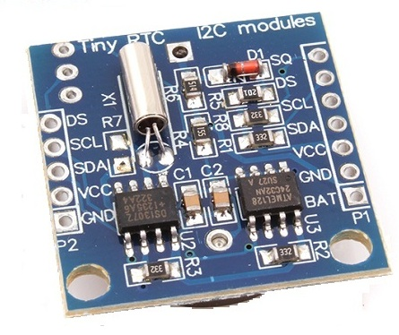

# PI2C_IO

Demo / Test code to play with interfacing between the RasPi and various I2C devices, including a custom Arduino I2C slave.

Testing on the Pi side
```
pi@raspberrypi:~$ sudo i2cdetect -y 1
     0  1  2  3  4  5  6  7  8  9  a  b  c  d  e  f
00:          -- -- -- -- -- -- -- -- -- -- -- -- --
10: -- -- -- -- -- -- -- -- -- -- -- -- -- -- -- --
20: -- -- -- -- -- -- -- -- -- -- -- -- -- -- -- --
30: -- 31 -- -- -- -- -- -- -- -- -- -- -- -- -- --
40: -- -- -- -- -- -- -- -- -- -- -- -- -- -- -- --
50: -- -- -- -- -- -- -- -- -- -- -- -- -- -- -- --
60: -- -- -- -- -- -- -- -- -- -- -- -- -- -- -- --
70: -- 71 -- -- -- -- -- --
```
0x31 is the custom Arduino slave

0x71 is the sparkfun 7-Segment-Display

https://www.sparkfun.com/products/11442

Writing to the sparkfun display us the command write_i2c_block_data with the command 0x76 to clear the display and then an array of the bytes to display.


Read from the Arduino at I2C address 0x31 using command 0x27 to read from AIO A7. A photo resistor voltage divider is connected to A7. The Arduino analog io is 10 bits, or values 0 to 1023 for 0 to AREF voltages. The AREF pin in the experiment is connected to VCC, which is around 3V3.

Read the A7 voltage into a temporary value then scale the two bytes to 10 bits.

Use the command i2c.read_i2c_block_data(0x31, 0x27, 2) to read from I2C address 0x31, requesting command 0x27, which is read analog input A7, and read 2 bytes.

Use the command i2c.read_i2c_block_data(0x31, 0x26, 2) to read from A6.

```
pi@raspberrypi:~$ sudo python
Python 2.7.3 (default, Mar 18 2014, 05:13:23)
[GCC 4.6.3] on linux2
Type "help", "copyright", "credits" or "license" for more information.
>>> import smbus
>>> i2c = smbus.SMBus(1)
>>> i2c.write_byte(0x71, 0x31)
>>> i2c.write_byte(0x71, 0x32)
>>> i2c.write_byte(0x71, 0x33)
>>> i2c.write_byte(0x71, 0x76)
>>> i2c.write_byte(0x71, 0x33)
>>> i2c.write_byte(0x71, 0x32)
>>> i2c.write_byte(0x71, 0x76)
>>> i2c.write_i2c_block_data(0x71,0x76,[1,2,3,4])
>>> i2c.write_i2c_block_data(0x71,0x76,[5,6,7,8])
>>> i2c.write_i2c_block_data(0x71,0x76,[1,2,3,4])
>>> i2c.write_i2c_block_data(0x71,0x76,[5,6,7,8])
>>>
>>> lgt = i2c.read_i2c_block_data(0x31, 0x27, 2)
>>> lgt[1]*256+lgt[0]
662
>>>
```

Adding a TinyRTC battery backed up real time clock and eeprom carrier board and scanning the i2c bus yields:

```
pi@raspberrypi:~$ i2cdetect -y 1
     0  1  2  3  4  5  6  7  8  9  a  b  c  d  e  f
00:          -- -- -- -- -- -- -- -- -- -- -- -- --
10: -- -- -- -- -- -- -- -- -- -- -- -- -- -- -- --
20: -- -- -- -- -- -- -- -- -- -- -- -- -- -- -- --
30: -- 31 -- -- -- -- -- -- -- -- -- -- -- -- -- --
40: -- -- -- -- -- -- -- -- -- -- -- -- -- -- -- --
50: 50 -- -- -- -- -- -- -- -- -- -- -- -- -- -- --
60: -- -- -- -- -- -- -- -- 68 -- -- -- -- -- -- --
70: -- 71 -- -- -- -- -- --
```

The real time clock is default to address 0x68 and the eeprom defaults to address 0x50.

The real time clock chip is a Dallas Semiconductor DS1307RTC.
The eeprom is an Atmel AT24C32.



Reading the real time clock with this command:

```
>>> tm = i2c.read_i2c_block_data(0x68, 0x00, 7)
>>> tm
[64, 52, 19, 7, 9, 4, 22]
```

The values are displayed in decimal but need to be interpreted in BCD (binary coded decimal) to read the time.


The RTC was read at 1:38 pm on Saturday April 9, 2016.

```
[64, 52, 19, 7, 9, 4, 22] read at 1:38 pm on 4/9/16

Convert to hex for BCD

40, 34, 13, 07, 09, 04, 16

Converting the BCD to time and date by using the register table yields:

13:34:40 Saturday 9/4/16

It looks like the RTC time is a bit off from the computer time.
```

Adding the HTU21D Temperature and Humidity sensor from Adafruit adds another device at address 0x40.

```
pi@raspberrypi:~$ i2cdetect -y 1
     0  1  2  3  4  5  6  7  8  9  a  b  c  d  e  f
00:          -- -- -- -- -- -- -- -- -- -- -- -- --
10: -- -- -- -- -- -- -- -- -- -- -- -- -- -- -- --
20: -- -- -- -- -- -- -- -- -- -- -- -- -- -- -- --
30: -- 31 -- -- -- -- -- -- -- -- -- -- -- -- -- --
40: 40 -- -- -- -- -- -- -- -- -- -- -- -- -- -- --
50: 50 -- -- -- -- -- -- -- -- -- -- -- -- -- -- --
60: -- -- -- -- -- -- -- -- 68 -- -- -- -- -- -- --
70: -- 71 -- -- -- -- -- --
```

I found using the smbus library did not work with this sensor. This sensor requires a convert request followed by a delay then a 3 byte data read. The smbus read functions that support multiple byte reads all send a command and then immediately attempt to read the requested number of bytes. If the bytes are not immediately available the read request fails.

This requires using lower level access to support writing the command, waiting an arbitrary delay, and then reading the results.

Others on the inter-webs experience similar read problems using the smbus libraries in python. Eventually a google search turned up an example in python using the lower level io access that worked.


------------------------------------------------------------------------------------------------------------

Interesting links along the way

http://www.raspberry-projects.com/pi/programming-in-python/i2c-programming-in-python/using-the-i2c-interface-2

http://www.gammon.com.au/forum/?id=10896
http://dsscircuits.com/articles/arduino-i2c-slave-guide


https://www.sparkfun.com/products/11442
https://learn.sparkfun.com/tutorials/using-the-serial-7-segment-display/all
https://github.com/sparkfun/Serial7SegmentDisplay/wiki/Basic-Usage
https://github.com/sparkfun/Serial7SegmentDisplay/wiki/Customizing%20the%20Display
https://github.com/sparkfun/Serial7SegmentDisplay/wiki/Special-Commands
https://github.com/sparkfun/Serial7SegmentDisplay/wiki/Serial-7-Segment-Display-Datasheet
http://cdn.sparkfun.com/datasheets/Components/LED/Serial-7-Segment-Display-v31.pdf


https://learn.sparkfun.com/tutorials/mma8452q-accelerometer-breakout-hookup-guide
https://github.com/sparkfun/MMA8452_Accelerometer
https://learn.adafruit.com/adafruit-htu21d-f-temperature-humidity-sensor/overview
https://learn.adafruit.com/adafruit-tmp007-sensor-breakout?view=all

https://www.sparkfun.com/products/10140
https://www.sparkfun.com/datasheets/Kits/Frequency-Counter-v11.pdf


